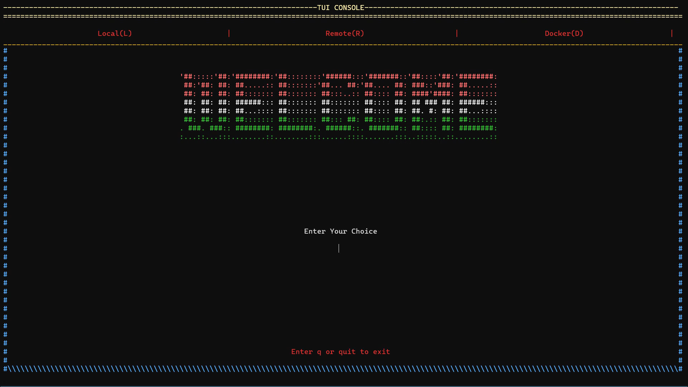
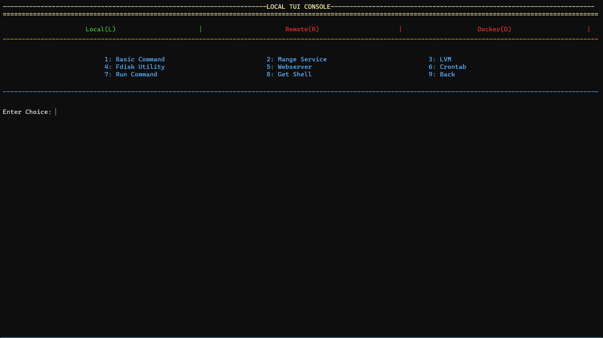
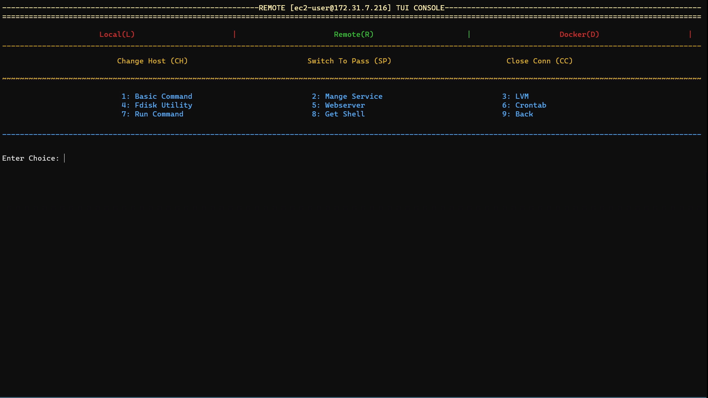
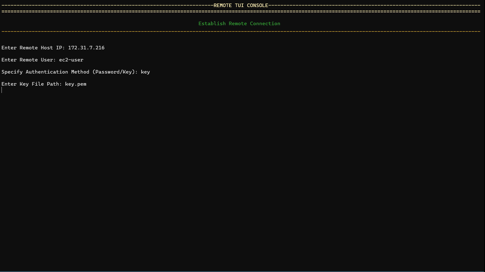
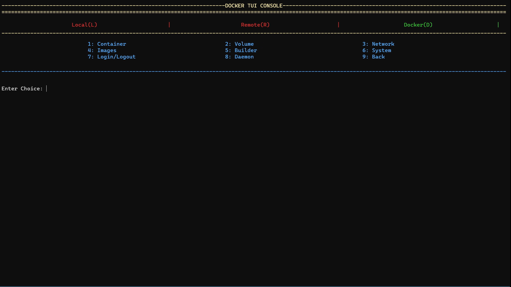

<h1 align="center"><b>Python: Linux Menu</b></h1>
<p align="center" style="font-size: 1.2rem;">Menu driven program for linux developed in python</p>
<p align="center">

<hr>

This menu provides multiple functionalities. Along with using a local system this menu can also be used to manage a remote system.

✔️ This menu can be used to -
- Run some basic Linux commands
- Manage Services/Daemons
- For Logical Volume Management (LVM)
- Schedule Cron Jobs
- For Docker management
- Manage Apache httpd webserver

For remote connection, this program supports both Password-Based Authentication and Key-Based Authentication. It is recommended to use key-based authentication because if password-based authentication is used then the password is asked every time while running commands on the remote system.

#### **💻 Currently Supported Platforms :-**
- RedHat Family -
  - *RedHat*
  - *CentOS*
  - *Amazon Linux*

<hr>

## **👉 Prerequisite**
- Required Python3
- Docker should be installed in order to manage docker
- Install required python modules from the requirements.txt file

<hr>

## **🤔 How to Use**

Install required Python libraries  
```bash
pip3 install -r requirements.txt
```
Run Menu Program
```bash
python3 main.py
```




<hr>

## **✨ Contributions are Welcomed**
- Can add more functions and flexibility to the menu
- Integration with more tools, programs, commands, etc
- Resolve or Report Bugs
- Can add a login security 
- Can enhance it with voice controls
- Improve Documentation

<hr>

## **☎️ Contact**

[Click here for Video and Post](https://www.linkedin.com/in/amanjhagrolia143)
  
***Feel free to Contact if any issue!!***

<a href="https://www.linkedin.com/in/amanjhagrolia143" target="_blank">  </a> 
